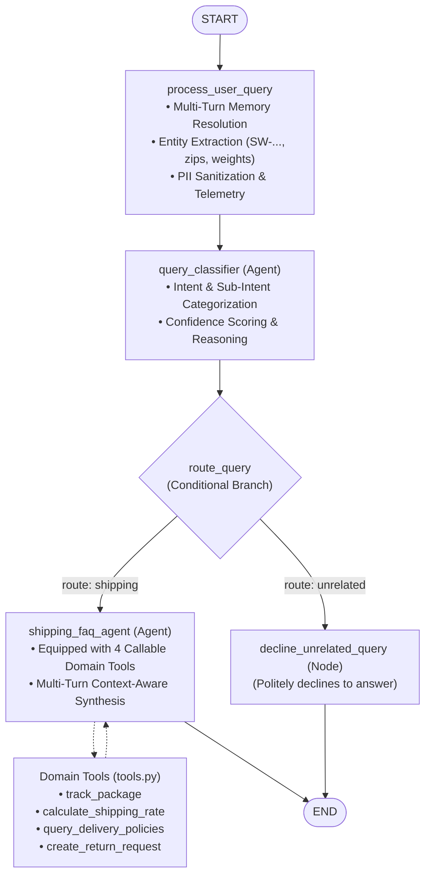

# customer-support-agent

An **ADK 2.0 (Agent Development Kit)** graph workflow project implementing an intelligent customer support representative for a shipping and logistics company (**SwiftShip**).

---

## Overview

The workflow acts as an automated triage and customer service pipeline. For every customer query:
1. It records and normalizes the customer's question into session state.
2. An intent classifier (`query_classifier`) evaluates whether the query is **shipping-related** (rates, tracking, delivery status, returns, label generation) or **unrelated** (general trivia, programming questions, weather forecasts, recipes, etc.).
3. Based on the classification, conditional routing branches to:
   - **Shipping FAQ Agent** (`shipping_faq_agent`): A specialized customer service agent that provides comprehensive, friendly answers regarding shipping rates, delivery timelines, tracking status, and return logistics.
   - **Decline Node** (`decline_unrelated_query`): A deterministic node that politely declines to answer non-shipping inquiries and explains the scope of available support.

Deployment files are omitted as requested.

---

## Workflow Topology & Architectural Highlights



---

## Key Capabilities

### 1. Tool & Interface Design
- **Callable Domain Tools** ([`tools.py`](tools.py)):
  - `track_package(tracking_number)`: Queries parcel status, origin, destination, ETA, and event timelines.
  - `calculate_shipping_rate(origin_zip, destination_zip, weight_lbs, service_tier)`: Instant dimensional rate calculation for Ground, Express, and Overnight tiers.
  - `query_delivery_policies(topic)`: Official policies on access point holds (7 days), signature requirements ($500+), and weekend deliveries.
  - `create_return_request(tracking_number, order_id, reason)`: Generates authorized RMA numbers, printable PDF label URLs, and mobile QR codes.
- **REST Interface Design** ([`server.py`](server.py)):
  - `POST /api/chat`: Typed chat turns returning tools used, memory context, trace IDs, and intent alignment.
  - `GET /api/tools`: Introspectable tool catalog with parameter schemas.
  - `GET /api/session/{id}` & `DELETE /api/session/{id}`: Session inspection and memory management.
  - `POST /api/feedback`: User satisfaction telemetry collection.

### 2. Context & Memory
- **Multi-Turn Entity Extraction** ([`memory.py`](memory.py)):
  - Continuously tracks package tracking IDs (`SW-...`), 5-digit postal codes, parcel weights, and order IDs across conversational turns.
  - Resolves implicit pronoun references (`"when will it arrive?"` automatically refers to previously mentioned tracking numbers).
  - Enriches the incoming prompt with active session memory so the agent maintains state across turns.

### 3. Orchestration & Logic
- **Granular Intent Classification**: Classifies queries into `shipping` (with sub-intents: `tracking`, `rates`, `delivery_policy`, `returns`, `general_faq`) vs. `unrelated`.
- **Fault-Tolerant Resilience Engine** ([`resilience.py`](resilience.py)):
  - Handles `503 UNAVAILABLE`, quota limits, and temporary model spikes with exponential backoff and jitter.
  - Automatic graceful degradation executes domain tools directly during model outages to ensure continuous service with zero HTTP 500/503 errors.

---

## Component Breakdown

| Component | Type | Responsibility |
|---|---|---|
| `process_user_query` | Function Node | Ingests query, extracts entities into `SessionMemory`, enriches prompt with cross-turn context, and sanitizes PII. |
| `query_classifier` | `LlmAgent` | Classifies intent into categories and sub-intents with confidence scoring. |
| `route_query` | Function Node | Evaluates classification output and directs workflow traversal. |
| `shipping_faq_agent` | `LlmAgent` + Tools | Tool-augmented agent executing tracking, rate calculations, policies, and RMA generation. |
| `decline_unrelated_query` | Function Node | Deterministic polite decline node handling non-shipping queries. |
| `root_agent` | `Workflow` | Top-level graph managing state transitions, memory propagation, and routing. |

---

## Project Structure

```text
customer-support-agent/
├── .dockerignore          # Docker build exclusions (.env, caches, venv)
├── .env.example           # Environment variable template for Gemini / Vertex AI
├── .gitignore             # Git exclusions for secrets, caches, and virtualenvs
├── Dockerfile             # Production container definition for Cloud Run
├── README.md              # Project documentation
├── __init__.py            # Package entry point exporting agent
├── agent.py               # ADK 2.0 Workflow definitions, schemas, and instrumented nodes
├── deploy.sh              # Sanitized Cloud Run deployment script
├── observability.py       # OpenTelemetry tracing, structured JSON logging, PII redaction & intent tracking
├── pyproject.toml         # Project metadata and dependencies
├── requirements.txt       # Python dependencies (google-adk, opentelemetry, etc.)
├── run.py                 # Interactive REPL and CLI runner with telemetry
├── run_mock.py            # Hermetic test runner for DAG verification
├── server.py              # FastAPI server with chat API, tracing middleware, and UI hosting
├── static/
│   └── index.html         # SwiftShip responsive Web UI with DAG trace inspector
└── tests/
    ├── __init__.py
    ├── test_observability.py # Unit tests for tracing, logging, PII redaction, intent tracking
    └── test_workflow.py   # Unit tests for schemas, nodes, and graph structure
```

---

## Observability & Tracing

The agent engine includes an observability framework built on **OpenTelemetry** and structured JSON logging:

### 1. OpenTelemetry Distributed Tracing
- **Span Hierarchy**: Every customer interaction creates a root span (`http.request` or `cli.query_turn`) containing child spans for workflow execution (`workflow.runner_execution`), user query processing (`workflow.process_user_query`), intent routing (`workflow.route_query`), and decline/FAQ execution.
- **Trace Context Propagation**: Automatically sets `X-Trace-Id` on HTTP responses for end-to-end correlation with frontend clients and upstream services.
- **Span Status & Exceptions**: Errors are captured via `span.record_exception()` and marked with `StatusCode.ERROR`.

### 2. Structured JSON Logging with Cloud Logging Correlation
- Every log message is formatted as a single-line JSON object compliant with Google Cloud Logging / W3C standards.
- Automatic correlation with active trace and span IDs:
  - `trace_id` and `span_id`
  - `logging.googleapis.com/trace` (`projects/{PROJECT_ID}/traces/{TRACE_ID}`)
  - `logging.googleapis.com/spanId`
  - `logging.googleapis.com/trace_sampled`
- Contextual attributes and structured error stack traces.

### 3. Intent vs. Outcome Tracking
- Tracks and audits every interaction by comparing:
  - **Detected Intent**: User query intent category (`shipping` vs `unrelated`) and LLM reasoning.
  - **Actual Outcome**: Target node executed (`shipping_faq_agent` vs `decline_unrelated_query`), action taken (`answered_faq` vs `declined_unrelated`), and execution alignment (`aligned` vs `mismatched`).
  - **Performance Metrics**: End-to-end execution latency in milliseconds.
- Emits a dedicated audit log event (`event_type: "intent_vs_outcome"`) and sets span attributes on the active trace.

### 4. PII Redaction Engine
- Real-time sanitization of customer data across logs, telemetry spans, and session state:
  - **Email Addresses**: `\b[A-Za-z0-9._%+-]+@[A-Za-z0-9.-]+\.[A-Za-z]{2,}\b` ➔ `[REDACTED_EMAIL]`
  - **Phone Numbers**: 7-digit, 10-digit, and international formats ➔ `[REDACTED_PHONE]`
  - **Credit / Debit Cards**: 13–16 digit payment card numbers ➔ `[REDACTED_CARD]`
  - **Social Security Numbers**: `###-##-####` ➔ `[REDACTED_SSN]`
  - **API Tokens & Secrets**: `ghp_...`, `AIza...`, `ya29...`, `AQ...` ➔ `[REDACTED_SECRET]`
- **Preserved Tracking Numbers**: SwiftShip tracking numbers (`SW-123456789`) are preserved to allow legitimate shipping status lookups.

---

## Getting Started

### 1. Prerequisites

- Python 3.10+
- Virtual environment (`venv` or `uv`)
- A Google AI Studio API key or GCP Vertex AI project

### 2. Installation

Create and activate a virtual environment, then install dependencies:

```bash
cd customer-support-agent
python3 -m venv .venv
source .venv/bin/activate
pip install -r requirements.txt
```

### 3. Configure Credentials

Copy `.env.example` to `.env` inside the `customer-support-agent/` directory:

```bash
cp .env.example .env
```

Edit `.env` to include your Google Gemini API key:

```bash
GOOGLE_GENAI_USE_ENTERPRISE=FALSE
GOOGLE_API_KEY=AIzaSy...
```

*(Alternatively, if using Vertex AI, configure `GOOGLE_GENAI_USE_ENTERPRISE=TRUE`, `GOOGLE_CLOUD_PROJECT`, and `GOOGLE_CLOUD_LOCATION`)*.

---

## Running the Agent

### Using the ADK CLI

**Interactive Terminal Mode:**
```bash
adk run .
```

**Single Query Execution:**
```bash
adk run . "How much does overnight shipping cost for a 5lb box?"
```

**Decline Example:**
```bash
adk run . "Can you help me write a Python script to sort a list?"
```

**Development Web UI:**
```bash
adk web .
```
Then navigate to `http://localhost:8000` to interact via the web interface.

---

### Running Programmatically in Python

You can execute the workflow within Python code using `InMemoryRunner`:

```python
import asyncio
from google.adk.runners import InMemoryRunner
from google.genai import types

from customer_support_agent.agent import root_agent

async def main():
    runner = InMemoryRunner(agent=root_agent, app_name="customer_support")
    session = await runner.session_service.create_session(
        app_name="customer_support",
        user_id="customer_1"
    )

    query = "Where is my package SW-123456789 and when will it arrive?"
    message = types.Content(
        role="user",
        parts=[types.Part.from_text(text=query)],
    )

    print(f"Customer: {query}\n")
    async for event in runner.run_async(
        user_id="customer_1",
        session_id=session.id,
        new_message=message,
    ):
        if event.content and event.content.parts:
            for part in event.content.parts:
                if part.text:
                    print(f"Agent: {part.text}")

if __name__ == "__main__":
    asyncio.run(main())
```

---

## Running Tests & Evaluation Suite

### Unit & Observability Tests
```bash
pytest tests/test_workflow.py tests/test_observability.py tests/test_secrets_manager.py -v
```

### Automated Evaluation against Golden Dataset
Evaluate the agent against the curated 25-case golden benchmark dataset with automated quality gates:
```bash
python eval/evaluate.py --min-accuracy 0.90 --output eval/eval_report.json
```
Metrics computed include:
- Intent classification accuracy & F1 score
- DAG routing alignment rate
- Latency benchmarks (P50, P95, mean)
- Detailed per-sample routing breakdown

---

## Secret Management (Google Cloud Secret Manager)

To eliminate plain-text `.env` files in production, secrets are dynamically loaded from Google Cloud Secret Manager via `secrets_manager.py`:
- **Secret ID**: `gemini-api-key` (configurable via `GEMINI_API_KEY_SECRET_ID`)
- **Mounting**: Automatically mounted into Cloud Run containers via Secret Manager environment variable references (`value_source.secret_key_ref`).
- **Local Development**: Automatically falls back to environment variables or `.env` when executing locally.
- **Redaction**: All secrets (`AIza...`, `ghp_...`, `ya29...`) are automatically redacted from logs and traces by `PIIRedactor`.

---

## Infrastructure as Code (Terraform)

Production infrastructure is fully codified under the `terraform/` directory:
- **Cloud Run v2 Service**: Auto-scaling (0-5 instances), CPU/memory limits, probes, and Secret Manager bindings.
- **Artifact Registry**: Docker repository for versioned container images.
- **Secret Manager**: Dedicated encrypted secret resource with least-privilege IAM bindings.
- **Service Account**: Minimal IAM roles (`secretmanager.secretAccessor`, `logging.logWriter`, `cloudtrace.agent`).

### Deploying with Terraform
```bash
cd terraform
cp terraform.tfvars.example terraform.tfvars
# Update terraform.tfvars with your GCP project ID
terraform init
terraform plan
terraform apply
```

---

## CI/CD Automation

Continuous Integration and Continuous Deployment are provided via two complementary pipelines:

1. **GitHub Actions (`.github/workflows/ci-cd.yml`)**:
   - **Security & Secret Scanning**: Automated audit for leaked tokens and syntax issues.
   - **Evaluation Quality Gate**: Runs unit tests and golden dataset evaluation, blocking PRs if accuracy drops below 90%.
   - **Terraform Validation**: Verifies IaC formatting and configuration.
   - **Container Build**: Automated Docker build and caching.
   - **Continuous Deployment**: Deploys approved commits on `main` directly to Cloud Run using Workload Identity Federation.

2. **Google Cloud Build (`cloudbuild.yaml`)**:
   - Native GCP build pipeline running golden evaluation tests, building and pushing images to Artifact Registry, and deploying to Cloud Run with Secret Manager mounting.

