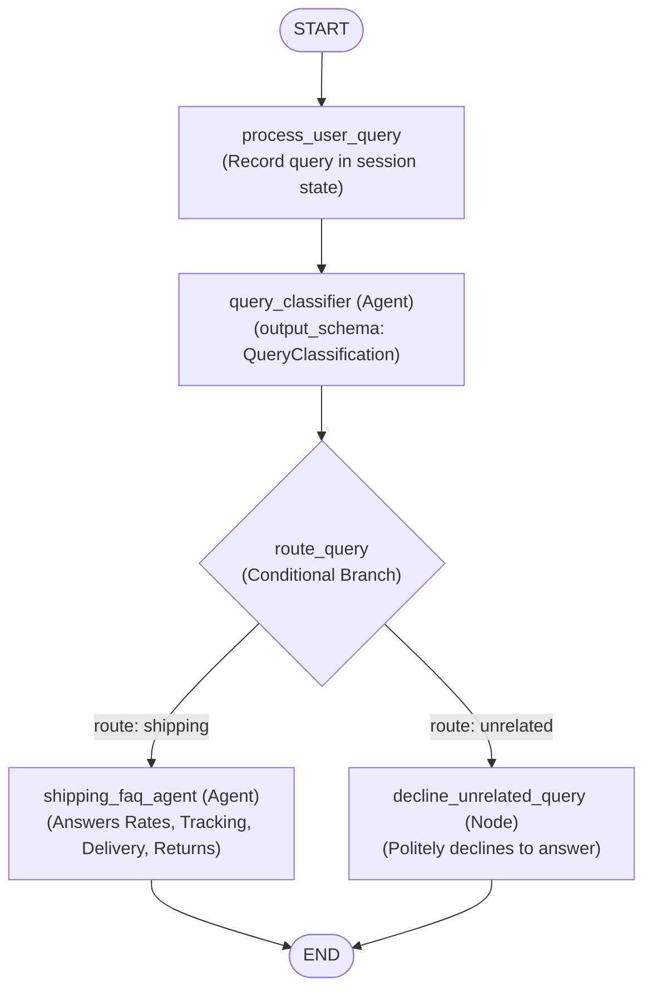

# customer-support-agent

An **ADK 2.0 (Agent Development Kit)** graph workflow project implementing an intelligent customer support representative for a shipping and logistics company (**SwiftShip**).

---

## Overview

The workflow acts as an automated triage and customer service pipeline. For every customer query:
1. It records and normalizes the customer's question into session state.
2. An intent classifier (`query_classifier`) evaluates whether the query is **shipping-related** (rates, tracking, delivery status, returns, label generation) or **unrelated** (general trivia, programming questions, weather forecasts, recipes, etc.).
3. Based on the classification, conditional routing branches to:
   - **Shipping FAQ Agent** (`shipping_faq_agent`): A specialized customer service agent that provides comprehensive, friendly answers regarding shipping rates, delivery timelines, tracking status, and return logistics.
   - **Decline Node** (`decline_unrelated_query`): A deterministic node that politely declines to answer non-shipping inquiries and explains the scope of available support.

Deployment files are omitted as requested.

---

## Workflow Topology



---

## Component Breakdown

| Component | Type | Responsibility |
|---|---|---|
| `process_user_query` | Function Node | Takes user message from `START`, outputs the query text, and populates `ctx.state['user_query']` for downstream template resolution. |
| `query_classifier` | `LlmAgent` | Evaluates the query using `gemini-2.5-flash` with a strict structured `output_schema` (`QueryClassification`) returning `"shipping"` or `"unrelated"`. |
| `route_query` | Function Node | Inspects the classification result and yields an `Event(route=...)` directing graph execution. |
| `shipping_faq_agent` | `LlmAgent` | Domain specialist handling shipping rates (ground, priority, overnight, international), tracking milestones, delivery windows/signatures, and return logistics. |
| `decline_unrelated_query` | Function Node | Yields customer-facing polite decline `Event(message=..., output=...)` to handle off-topic requests. |
| `root_agent` | `Workflow` | Top-level graph combining sequential transitions and conditional branching. |

---

## Project Structure

```text
customer-support-agent/
├── .env.example          # Environment variable template for Gemini / Vertex AI
├── .gitignore            # Git exclusions for secrets, caches, and virtualenvs
├── __init__.py           # Package entry point exporting agent
├── agent.py              # ADK 2.0 Workflow definitions, schemas, and nodes
├── pyproject.toml        # Project metadata and dependencies
├── requirements.txt      # Python dependencies
├── README.md             # Project documentation
└── tests/
    ├── __init__.py
    └── test_workflow.py  # Unit tests for schemas, nodes, and graph structure
```

---

## Getting Started

### 1. Prerequisites

- Python 3.10+
- Virtual environment (`venv` or `uv`)
- A Google AI Studio API key or GCP Vertex AI project

### 2. Installation

Create and activate a virtual environment, then install dependencies:

```bash
cd customer-support-agent
python3 -m venv .venv
source .venv/bin/activate
pip install -r requirements.txt
```

### 3. Configure Credentials

Copy `.env.example` to `.env` inside the `customer-support-agent/` directory:

```bash
cp .env.example .env
```

Edit `.env` to include your Google Gemini API key:

```bash
GOOGLE_GENAI_USE_ENTERPRISE=FALSE
GOOGLE_API_KEY=AIzaSy...
```

*(Alternatively, if using Vertex AI, configure `GOOGLE_GENAI_USE_ENTERPRISE=TRUE`, `GOOGLE_CLOUD_PROJECT`, and `GOOGLE_CLOUD_LOCATION`)*.

---

## Running the Agent

### Using the ADK CLI

**Interactive Terminal Mode:**
```bash
adk run .
```

**Single Query Execution:**
```bash
adk run . "How much does overnight shipping cost for a 5lb box?"
```

**Decline Example:**
```bash
adk run . "Can you help me write a Python script to sort a list?"
```

**Development Web UI:**
```bash
adk web .
```
Then navigate to `http://localhost:8000` to interact via the web interface.

---

### Running Programmatically in Python

You can execute the workflow within Python code using `InMemoryRunner`:

```python
import asyncio
from google.adk.runners import InMemoryRunner
from google.genai import types

from customer_support_agent.agent import root_agent

async def main():
    runner = InMemoryRunner(agent=root_agent, app_name="customer_support")
    session = await runner.session_service.create_session(
        app_name="customer_support",
        user_id="customer_1"
    )

    query = "Where is my package SW-123456789 and when will it arrive?"
    message = types.Content(
        role="user",
        parts=[types.Part.from_text(text=query)],
    )

    print(f"Customer: {query}\n")
    async for event in runner.run_async(
        user_id="customer_1",
        session_id=session.id,
        new_message=message,
    ):
        if event.content and event.content.parts:
            for part in event.content.parts:
                if part.text:
                    print(f"Agent: {part.text}")

if __name__ == "__main__":
    asyncio.run(main())
```

---

## Running Tests

Execute the automated test suite with pytest:

```bash
pytest
```
